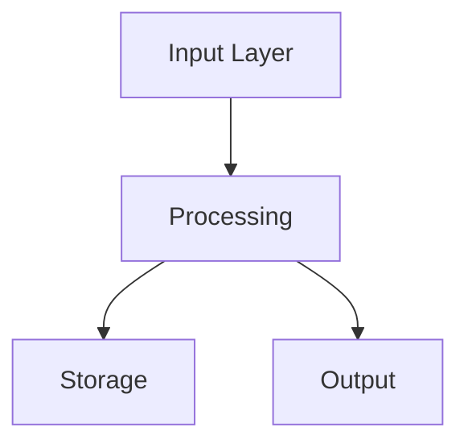

# {{PROJECT_NAME}} - Design Doc

**Paste this into Notion as the page content**

After pasting, replace `{{PROJECT_NAME}}` with your actual project name and `{{DATE}}` with today's date.

---

## 🎯 PROJECT SNAPSHOT

| Field | Value |
|-------|-------|
| **Status** | Ideating |
| **Current Phase** | 0 - BRAINDUMP |
| **Last touched** | {{DATE}} |
| **Next action** | Add materials to braindump/ or skip to Phase 1 |
| **Blockers** | None |

### Phase Progress

| # | Phase | Status | Description |
|---|-------|--------|-------------|
| 0 | BRAINDUMP | ⏸️ Pending | Process accumulated materials (optional) |
| 1 | CAPTURE | ○ Pending | Get the core idea out |
| 2 | EXPAND | ○ Pending | Explore scope and possibilities |
| 3 | SPECIFY | ○ Pending | Create detailed requirements (PRD) |
| 4 | ARCHITECT | ○ Pending | Design system structure |
| 5 | CONFIGURE | ○ Pending | Define tech stack and setup |
| 6 | SEED | ○ Pending | Generate buildable scaffold |

**Legend:** ✅ Complete | → In Progress | ○ Pending | ⏭️ Skipped | ⏸️ Optional

---

## 💡 THE IDEA

**One-liner:** [Not yet defined - complete in Phase 1]

**The spark:** [What triggered this idea? What problem did you personally hit?]

**Core insight:** [The non-obvious thing that makes this work - what's your unfair advantage or key realization?]

---

## 🏗️ SYSTEM OVERVIEW

**Purpose:** [What problem does this solve? For whom?]

**Scope:**
- ✅ IN: [What's included in this project]
- ❌ OUT: [What's explicitly NOT part of this]

**Key actors:**
- [Who or what interacts with this system?]
- [Users? Other systems? APIs?]

---

## 🧩 COMPONENTS

| Component | Role | Inputs | Outputs | Status |
|-----------|------|--------|---------|--------|
| *None defined yet* | | | | |

*Add components as they're identified. Status: idea → designed → building → done*

---

## 🔗 RELATIONSHIPS

*How do the components connect? What are the data flows and dependencies?*

```
[Component A] --data--> [Component B] --triggers--> [Component C]
```

*Can add a Mermaid diagram:*



---

## 🚶 USER JOURNEYS

### Primary Flow
1. User does [X]
2. System responds with [Y]
3. User then [Z]
4. ...

### Entry Points
- [How do users first encounter this?]
- [What triggers them to use it?]

### Key Interactions
- [What are the main things users DO in this system?]

---

## ✅ DECISIONS LOG

| Decision | Options Considered | Chosen | Rationale | Date |
|----------|-------------------|--------|-----------|------|
| *None yet* | | | | |

*Record decisions so future-you knows WHY things are the way they are.*

---

## ❓ OPEN QUESTIONS

- [ ] What's the MVP scope?
- [ ] Who's the primary user persona?
- [ ] What's the key differentiator from existing tools?
- [ ] What's the data model?
- [ ] What integrations are essential vs nice-to-have?

*Add questions as they arise. Check them off when answered (move answer to Decisions Log).*

---

## 📋 NEXT ACTIONS

- [ ] Add braindump materials (or skip Phase 0)
- [ ] Complete THE IDEA section (spark + core insight)
- [ ] Define SYSTEM OVERVIEW (purpose, scope, actors)
- [ ] Identify 3-5 initial COMPONENTS
- [ ] Sketch primary USER JOURNEY

*Always have at least one clear next action.*

---

## 📜 SESSION LOG

| Date | Duration | Phase | What Changed |
|------|----------|-------|--------------|
| {{DATE}} | - | 0 | Page created with Design Doc template |

*Brief log of planning sessions for context.*

---

## 📥 BRAINDUMP MATERIALS

*Summary of processed braindump materials (Phase 0)*

### Source Materials Processed
- [ ] [List materials as they're added]

### Extracted Insights
*Key themes from meta-analysis (see braindump/extracted-insights.md)*

### Dream Synthesis Highlights
*Notable ideas from creative synthesis (see braindump/dream-synthesis.md)*

---

## 📝 SPECIFICATION

*Detailed requirements (Phase 3)*

### PRD Link
[Link to PRD in spec/ folder when created]

### Key Requirements
*High-level requirements extracted from PRD*

---

## 🏛️ ARCHITECTURE

*System design (Phase 4)*

### Architecture Document
[Link to architecture doc when created]

### Key Design Decisions
*Architectural decisions extracted from design*

---

## ⚙️ CONFIGURATION

*Tech stack and setup (Phase 5)*

### Tech Stack
| Layer | Technology | Why |
|-------|------------|-----|
| *TBD* | | |

### Configuration Requirements
*Setup and configuration needs*

---

## 🌱 SEED OUTPUT

*Generated scaffold (Phase 6)*

### Scaffold Location
[Link to generated project when seeded]

### What Was Generated
*Summary of generated project structure*
