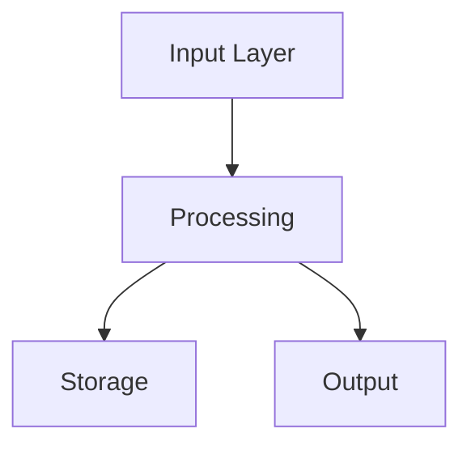

# {{PROJECT_NAME}} - Design Doc

**Paste this into Notion as the page content**

After pasting, replace `{{PROJECT_NAME}}` with your actual project name and `{{DATE}}` with today's date.

---

## 🎯 PROJECT SNAPSHOT

| Field | Value |
|-------|-------|
| **Status** | Ideating |
| **Current Phase** | 0 - INCUBATE |
| **Last touched** | {{DATE}} |
| **Next action** | Run /incubate with materials, or skip to Phase 1 |
| **Related Projects** | *None yet - discovered during incubation* |

### 🚧 Current Blockers
*None - ready to proceed*

### ⚠️ Active Gaps
*None identified yet*

### Phase Progress

| # | Phase | Status | Description |
|---|-------|--------|-------------|
| 0 | INCUBATE | ⏸️ Pending | Cognitive incubation - AI builds deep understanding (optional) |
| 1 | CAPTURE | ○ Pending | Get the core idea out |
| 2 | EXPAND | ○ Pending | Explore scope and possibilities |
| 3 | SPECIFY | ○ Pending | Create detailed requirements (PRD) |
| 4 | ARCHITECT | ○ Pending | Design system structure |
| 5 | CONFIGURE | ○ Pending | Define tech stack and setup |
| 6 | SEED | ○ Pending | Generate buildable scaffold |

**Legend:** ✅ Complete | → In Progress | ○ Pending | ⏭️ Skipped | ⏸️ Optional

---

## 💡 THE IDEA

**One-liner:** [Not yet defined - complete in Phase 1]

**The spark:** [What triggered this idea? What problem did you personally hit?]

**Core insight:** [The non-obvious thing that makes this work - what's your unfair advantage or key realization?]

---

## 🏗️ SYSTEM OVERVIEW

**Purpose:** [What problem does this solve? For whom?]

**Key actors:**
- [Who or what interacts with this system?]
- [Users? Other systems? APIs?]

---

## ✅ IN SCOPE

*What this project DOES include:*

- [ ] [Core feature 1]
- [ ] [Core feature 2]
- [ ] [Core feature 3]

---

## 🚫 OUT OF SCOPE

*What this project explicitly does NOT include (prevents scope creep):*

- ❌ [Not doing X]
- ❌ [Not building Y]
- ❌ [V2 feature - deferred]

*Reference this section when conversations drift. If something's not here, it's fair game.*

---

## 🤔 ASSUMPTIONS

*Things we're taking for granted (must be validated):*

| Assumption | Status | Notes |
|------------|--------|-------|
| *None yet* | | |

**Status:** ✅ Validated | ⚠️ Unvalidated | ❌ Rejected

*Surface assumptions explicitly. Invalid assumptions kill projects.*

---

## 🧩 COMPONENTS

| Component | Role | Inputs | Outputs | Status |
|-----------|------|--------|---------|--------|
| *None defined yet* | | | | |

*Add components as they're identified. Status: idea → designed → building → done*

---

## 🔗 RELATIONSHIPS

*How do the components connect? What are the data flows and dependencies?*

```
[Component A] --data--> [Component B] --triggers--> [Component C]
```

*Can add a Mermaid diagram:*



---

## 🚶 USER JOURNEYS

### Primary Flow
1. User does [X]
2. System responds with [Y]
3. User then [Z]
4. ...

### Entry Points
- [How do users first encounter this?]
- [What triggers them to use it?]

### Key Interactions
- [What are the main things users DO in this system?]

---

## ✅ DECISIONS LOG

| Decision | Options Considered | Chosen | Rationale | Date |
|----------|-------------------|--------|-----------|------|
| *None yet* | | | | |

*Record decisions so future-you knows WHY things are the way they are.*

---

## ❓ OPEN QUESTIONS

*Questions that need answers to proceed. Blocking questions marked with 🚧*

| Question | Priority | Blocking? | Answer |
|----------|----------|-----------|--------|
| What's the MVP scope? | High | 🚧 | |
| Who's the primary user persona? | High | 🚧 | |
| What's the key differentiator? | Medium | | |
| What's the data model? | Medium | | |
| What integrations are essential? | Low | | |

*When answered → Move to Decisions Log*

---

## ⚡ RISKS & UNKNOWNS

*What could go wrong? What don't we know yet?*

| Risk | Likelihood | Impact | Mitigation |
|------|------------|--------|------------|
| *None identified yet* | | | |

**Likelihood:** High / Medium / Low
**Impact:** High / Medium / Low

*Identify risks early. Unknown unknowns kill projects.*

---

## 📋 NEXT ACTIONS

- [ ] Add braindump materials (or skip Phase 0)
- [ ] Complete THE IDEA section (spark + core insight)
- [ ] Define SYSTEM OVERVIEW (purpose, scope, actors)
- [ ] Identify 3-5 initial COMPONENTS
- [ ] Sketch primary USER JOURNEY

*Always have at least one clear next action.*

---

## 📜 SESSION LOG

| Date | Duration | Phase | What Changed |
|------|----------|-------|--------------|
| {{DATE}} | - | 0 | Page created with Design Doc template |

*Brief log of planning sessions for context.*

---

## 🧠 INCUBATION INSIGHTS

> *Conceptual context from Phase 0 - informs but doesn't constrain*
> *This is the AI's cognitive understanding, not specification*

### Essence
*What this project is really about at its core*

### Personal Resonance
*Why this matters specifically - based on patterns and motivations*

### Related Projects
*Cross-project connections discovered during incubation*

| Project | Connection | Transferable Pattern |
|---------|------------|---------------------|
| *None yet* | | |

### Creative Seeds
*Novel ideas, "what if" possibilities, unexpected angles*
-

### Unresolved Tensions
*Questions and competing priorities to explore in capture*
-

### Source Materials Processed
- [ ] [List materials as they're added to braindump/source-materials/]

---

## 📥 BRAINDUMP MATERIALS

*Raw materials directory: `braindump/source-materials/`*
*Dream journal: `braindump/dream-journal.md`*

---

## 📝 SPECIFICATION

*Detailed requirements (Phase 3)*

### PRD Link
[Link to PRD in spec/ folder when created]

### Key Requirements
*High-level requirements extracted from PRD*

---

## 🏛️ ARCHITECTURE

*System design (Phase 4)*

### Architecture Document
[Link to architecture doc when created]

### Key Design Decisions
*Architectural decisions extracted from design*

---

## ⚙️ CONFIGURATION

*Tech stack and setup (Phase 5)*

### Tech Stack
| Layer | Technology | Why |
|-------|------------|-----|
| *TBD* | | |

### Configuration Requirements
*Setup and configuration needs*

---

## 🌱 SEED OUTPUT

*Generated scaffold (Phase 6)*

### Scaffold Location
[Link to generated project when seeded]

### What Was Generated
*Summary of generated project structure*
