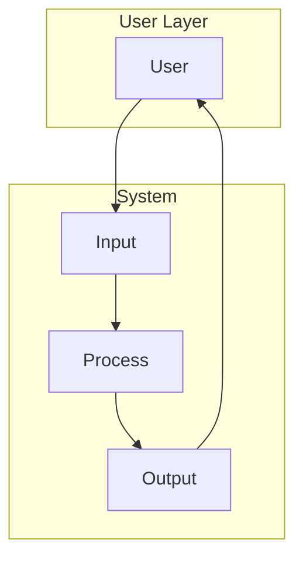
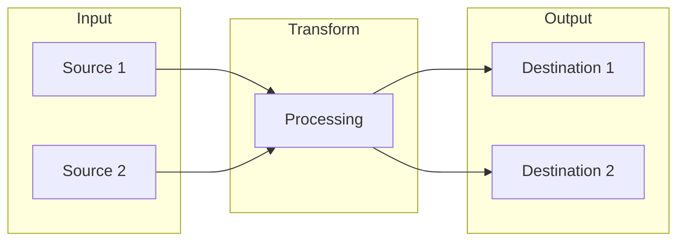
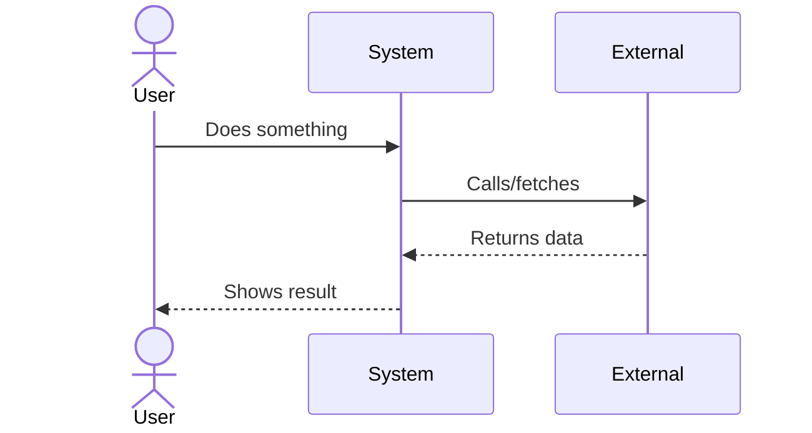
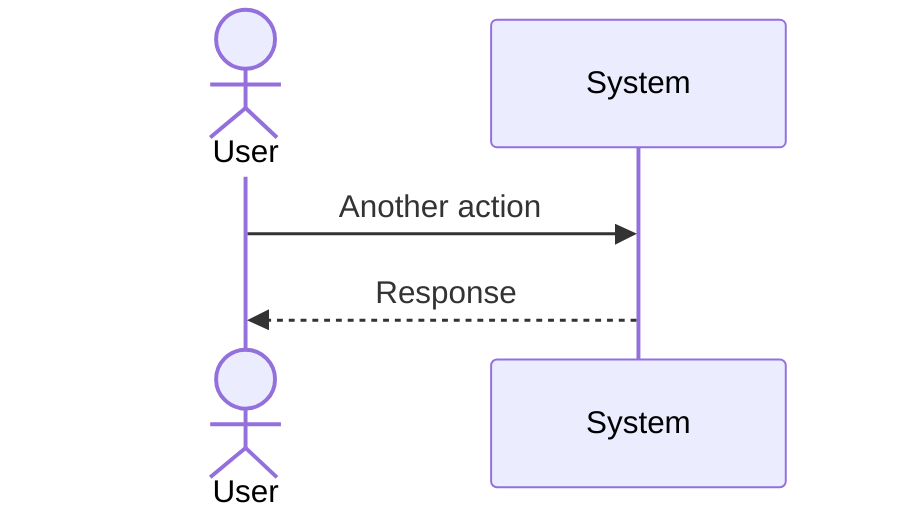
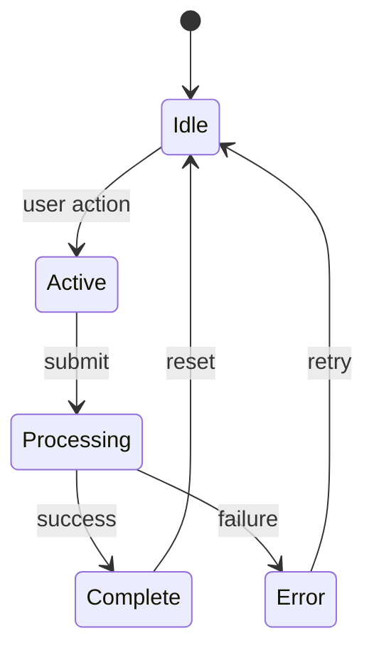

# {{PROJECT_NAME}} - System Canvas

**Visual companion to Design Doc - paste into Notion**

---

## 🎬 THE SCENARIO

*How does someone actually use this? Walk through it.*

### The Setup
**Who:** [User type]
**Context:** [What situation are they in?]
**Trigger:** [What makes them reach for this?]

### The Flow

```
1. User [does what first]
   ↓
2. System [responds how]
   ↓
3. User [then does]
   ↓
4. System [produces what]
   ↓
5. Result: [What's different now?]
```

---

## 🗺️ SYSTEM MAP

*Bird's eye view - what are the pieces and how do they connect?*



*Update this diagram as the system takes shape*

---

## 🔄 DATA FLOW

*What moves through the system? Where does it come from, where does it go?*



---

## 🎭 KEY INTERACTIONS

*The main things users DO - as sequence diagrams*

### Primary Action



### Secondary Action



---

## 🧱 COMPONENT SKETCH

*Visual layout of major pieces*

```
┌─────────────────────────────────────────────────────┐
│                    [System Name]                     │
├─────────────────────────────────────────────────────┤
│                                                      │
│   ┌──────────┐    ┌──────────┐    ┌──────────┐     │
│   │          │    │          │    │          │     │
│   │ Input    │───▶│ Process  │───▶│ Output   │     │
│   │          │    │          │    │          │     │
│   └──────────┘    └──────────┘    └──────────┘     │
│        │               │               │            │
│        ▼               ▼               ▼            │
│   ┌──────────┐    ┌──────────┐    ┌──────────┐     │
│   │ Storage  │    │ External │    │ Storage  │     │
│   └──────────┘    └──────────┘    └──────────┘     │
│                                                      │
└─────────────────────────────────────────────────────┘
```

---

## 🎯 STATE DIAGRAM

*What states can the system be in? What triggers transitions?*



---

## ❓ VISUAL UNKNOWNS

*Sketch what you're not sure about - boxes with question marks*

```
┌─────────────┐      ┌─────────────┐
│   Known     │  ?   │   Unknown   │
│   Part      │─────▶│   Part      │
└─────────────┘      └─────────────┘
                           │
                           ▼
                     ┌─────────────┐
                     │     ??      │
                     └─────────────┘
```

*What's in the boxes you can't fill in yet?*

---

## 🔗 INTEGRATION POINTS

*Where does this system touch other systems?*

| External System | Direction | What's Exchanged |
|-----------------|-----------|------------------|
| | → sends to | |
| | ← receives from | |
| | ↔ bidirectional | |

---

## 📐 SCALE SKETCH

*How big is this? Orders of magnitude.*

| Dimension | Estimate | Notes |
|-----------|----------|-------|
| Users | ~10 / ~100 / ~1000+ | |
| Data volume | KB / MB / GB | |
| Requests | /day / /hour / /min | |
| Components | 1-3 / 5-10 / 10+ | |

---

*This canvas is for thinking visually. Keep it rough. The Design Doc has the details.*
